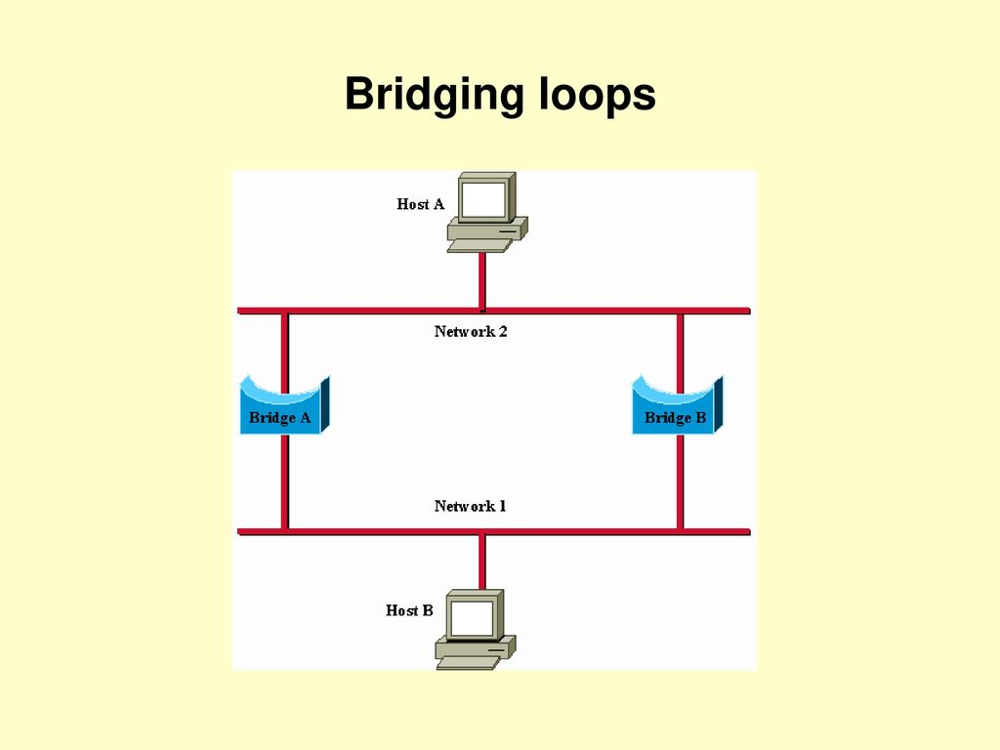

# Bridging Loops (Bucles de Puentes)

Sin un protocolo bridge-to-bridge (puente-a-puente), el algoritmo de [puente transparente](puentes_transparentes.md)
falla cuando exiten múltiples rutas de puentes y redes de área local (LANs).

Bridging Loops puede resultar en reenvíos y aprendizajes inexactos en entornos de puentes tranparentes.

Supongamos que el host A envía una trama al host B. Ambos puentes reciben la trama y aprenden
correctament que el host A está en el segmento 2. Cada puente reenvía la trama al segmento 1. 
Lamentablemente, no sólo el host B recibirá dos copias de la trama (una por cada puente), sino que 
además cada puente cree que el host A reside en el mismo segmento que el host B. Cuando el host B
responde a la trama del host A,ambos puentes recbirán y posteriormente filtrarán las respuestas ya que
el puente-tabla indicará que el destino (host A) está en el mismo segmento de red que el origen de la 
trama.

Además de los problemas básicos de conectividad, la proliferación de mensajes de difusión en redes con 
bucles, representan un problema serio Ambos puentes remiten tramas sin fin, utilizando ancho de banda 
disponible y bloque la transmisión de otros paquetes en ambos segmentos.

Un bucle implica la existencia de múltiples rutas de acceso a través de la red interna y una red con
estas características puede aumentar la tolerancia a fallas a través de una mejor flexibilidad de la
topología de la red.