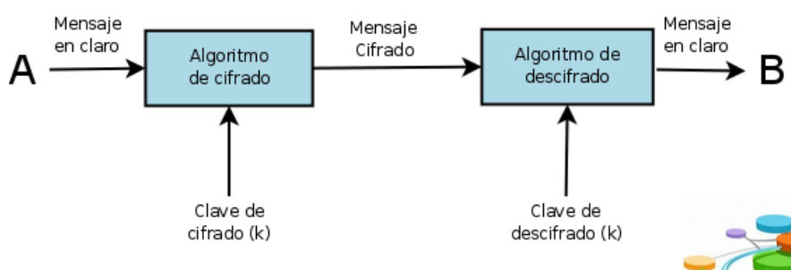
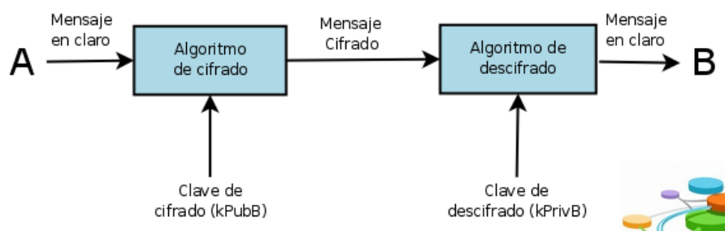

# Criptografía Simétrica

Se basa en la utilización de la misma clave para el cifrado y para el descifrado.

Ventajas:

	- Sencillez en su implementación
	- Rapidez
	- Robustez

Desventajas:

	- Privacidad
	- Autenticación
	- Integridad
	- No garantiza No Repudio

El emisor cifra el mensaje con la clave K y se lo envía al receptor. Éste último, que conoce dicha clave, la utiliza para descifrar el mensaje.

# Criptografía Asimétrica (clave pública)

Se basa en la utilización de dos claves relacionadas, una para cifrar y otra para descifrar (
denominadas **clave pública** y **clave privada**).

La seguridad está basada en la dificultad de deducir una clave a partir del conocimiento de la otra (la 
clave privada a partir de la clave pública).

Ventajas:

	- Mayor escalabilidad en la distribución de las claves
	- Integridad
	- Autenticidad
	- Privacidad
	- Garantiza No Repudio

Desventajas:

	- Mayor tiempo de procesamiento
	- Necesidad de autenticar las claves

El usuario A cifra un mensaje con la clave pública del usuario B (destinatario), éste para descifrarlo utiliza su clave secreta correspondiente, únicamente conocida por él.