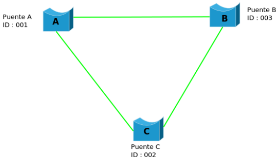
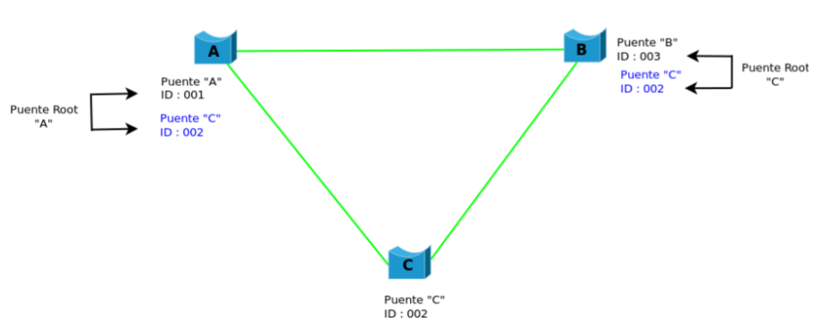
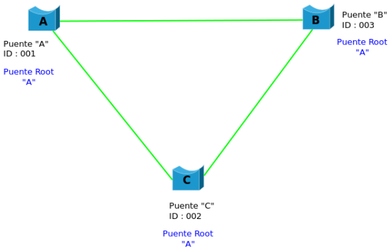

# Spanning Tree

Se desarrolló el protocolo Spanning Tree para conservar los beneficios de los blucles eliminando sus 
problemas.

El STA designa un subconjunto sin bucles de la topología de la red, colocando los puertos puentes que,
si estaban activos crearían un bucle, en condición de bloqueado. Pueden activarse los puertos puentes 
bloqueados en caso de un falo de un enlace primario, proporcionando una nueva ruta a través de la red 
interna.

El STA pide que se asigne a cada puente un identificador único. Normalmente, este identificador es una 
dirección MAC del puente, más una prioridad asignada administrativamente.

Finalmente, cada puerto de cada puente está asociado con un costo de trayectoria que representa el 
costo de transmitir una trama en una LAN a través de ese puerto. Los costos de las rutas suelen ser 
predeterminados pero, pueden ser asignados manualmente por los administradores de la red.

La primera actividad de Spanning Tree es la selección del **puente raíz**, que ess el puente con el 
identificador más bajo. A continuación, se determina el puente raíz con todos los demás puentes. El 
**puerto raíz** es el puerto a través del cual se pueden alcanzar todos los demás puentes.

Finalmente, se determinan los **puentes designados**. Un puento designado es el puente que representa 
el mínimo coste de trayectoria hacia la raíz (de cada LAN).

Utilizando este proceso, todos los puentes son eliminados menos uno de los puentes directamente conectados a cada LAN, eliminando así todos los bucles de dos LAN.

### Estados de los Puertos

``Bloqueado``, se pueden recibir BPDU pero no los reenviará. Las tramas se descartan y no se 
actualizan las direcciones MAC de las tablas. Todos los switches comienzan con este estado ya que si 
realizan envíos (fordwarding) podrían estar generando un loop.

``Escucha``, se llega desde el estado de bloqueado. En este estado, los switches determinan si existen 
alguna otra ruta hacia el puente raíz. En el caso de que la nueva ruta tenga un costo mayor, se vuelve 
al estado de bloqueado. Las tramas se descartan y no se actualizan las tablas de direcciones MAC. Se 
procesan BPDU.

``Aprendizaje``, se llega desde el estado de escucha. Las tramas de datos se descartan pero se 
actualizan las tablas de direcciones MAC. Se procesan BPDU.

``Envío``, se llega desde el estado de aprendizaje. El puerto puede enviar y recibir datos. Las tramas de datos se envían y se actualizan las tablas de direcciones MAC. Se procesan BPDU.

``Desactivado``, se puede llegar desde cualquier estado. Se produce cuando un administrador deshabilita el puerto o éste falla. No se procesan BPDU.

### Operatoria del Protocolo STA

Teniendo en cuenta la siguiente topología:

El algoritmo de Spanning Tree pide que se asigne a cada puente un identificador único. Normalmente, 
este identificador es una de las direcciones de control de acceso al medio (MAC) del puente, más una 
prioridad asignada administrativamente.

En una primera instancia, cada puente piensa que es Root y envía un mensaje anunciandose como tal junto 
con su identificador (MAC y puerto).

Entonces, cada puente compara su identificador con el identificador del primer puente que le llegó. Si 
*"C"* envió un mensaje anunciándose  como Root, *"A"* y *"B"* compararán sus identificadores. El menor será establecido como Root.

Cuando se finalice todo el intercambio, quedará definido el puente Root. Siguiendo con el ejemplo, 
podemos ver que el puente *"A"* quedará definido como Root. Ahora *"B"* y *"C"* deben establecer el 
puerto *"A"* como Root.

Cada tipo de enlace tiene un costo administrativo diferente, siendo de un costo menor el puerto con 
mayor velocidad. Si hubiera un empate entre los costos para determinar el puente Root, entonces se 
eligirá como *Puerto Designado* aquél on menor ID de puente.

Aquellos puertos que no so designados y que no son Root, deben bloquearse para evitar bucles.