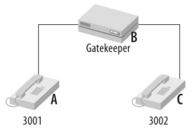

# VoIP

Envía voz y video a través de una red basada en IP.

Estas señales se envían entre los dispositivos como la central privada (PBX) antes de que pueda 
producirse cualquier comunicación.

VoIP toma todos los mensajes de señalización y los coloca sobre los paquetes IP.

VoIP utiliza el protocolo TCP/IP.

Cuando se realiza una llamada, nuestra voz se digitaliza y se envía en paquetes de datos. Cuando 
alcanza su destino, son ensamblados de nuevo y convertidos a señal de voz digital.

#### Arquitectura VoIP

**Soporte**: autenticación, autorización y estadísticas entre dominios ya que no todos puede aplicar 
prioridades.

**Transmisión**: encapsulamiento de los datos de audio y video. Cuando se transmite en tiempo real, se 
le agrega una marca de tiempo o identificador.

**Señalización**: se encuentra la localización de los dispositivos (ubicación del destino), el 
establecimiento de la llamada y su finalización. Además de las características de la sesión.

#### Servidor de Llamadas
Los teléfonos se registran en el servidor de llamadas. Este puede controlar la seguridad y el control 
de admisión mientras conecta los teléfonos.

#### Gateway
Se suele utilizar para conectar la red interna al resto del mundo. El gateway conectará terminales de 
cada lado, traducirá entre lo dos sistemas o proporcionará características.

#### Protocolo IP
Existen dos tipos de protocolo VoIP: **señalización** y **transporte**.
Los protocolos de *señalización* se ocupan de todas las funciones realizadas por los protocolos 
tradicionales, como la red digital de servicios. El protocolo de *transporte* se utiliza para 
encapsular o transportar los datos de voz reales, por medio del protocolo RTP. Los paquetes de datos se 
crean con un codec y luego se encapsulan dentro de RTP (Real Time Protocol)

#### Codec
Para convertir señales de voz analógica a una serie de muestras digitals en la fuente y reensamblar e 
el receptor. Para un sistema tradicional, el codec puede ubicarse físicamente en el teléfono o en la 
PBX. Los codecs también pueden comprimir los datos de voz

#### Componentes NO IP
El protocolo VoIP depende de una serie de servicios que no son específicos de VoIP: DHCP, DNS, TFTP, 
NTP.

### Protocolo VoIP
Los protocolos de señalización manejan las funciones derivadas con la arquitectura el servicio 
telefónico y, los protocolos de transporte llevan los paquetes de voz generados desde el codec. Una vez 
que se ha establecido la llamada, los paquetes de datos de voz se envían directamente entre los 
teléfonos.

#### Protocolos de Señalización
	- Localización, donde esta ubicado el dispositivo.
	- Establecimiento de la llamada.
	- Características de la sesión.
	- Finalización de la llamada.

#### Protocolo H.323 (*Señalización*)
Define la forma de proveer sesiones de comunicación audiovisual sobre los paquetes de red.
Conjunto de normas para una videoconferencia.
No garantiza calidad de servicio, y el transporte de datos puede ser o no fiable.

Componentes clásicos:

- Terminales, teléfonos IP u otros dispositivos.
- Gatekeeper, autoridad de registro.
- Multipoint Control Unit, replicadores de streaming.

Pasos para una llamada exitosa:
1. Al iniciar el teléfono
	- DHCP para obtener una dirección IP.
	- TFTP para obtener información de configuración.
	- Descubrimiento el gatekeeper y registro ante él.

2. Al realizar la llamada:
	- Se establece una conexión con el extremo mediante H.225.
	- Se negocian parámetros de la llamada o sesión.
	- Se intercambian los paquetes de voz mediante RTP.
	- Mediante RTCP se anuncia la información de performance del canal de voz.
	- Se cierra la sesión de voz vía H.245
	- Se cierra la conexión vía H.225.

#### Protocolo SIP (*Señalización*)
Tiene la intensión de ser el estandar para la inicialización, modificación y finalización de sesiones 
interactivas donde intervienen elementos multimedia.

Las funciones básicas del protocolo incluyen:

	- Determinar la ubicación de los usuarios, aportando movilidad.
	- Establecer, modificar y terminar sesiones.

Componenetes del protocolo:

**User Agent**: son los que emiten y consumen los mensajes del protocolo SIP. Son los extremos de la 
comunicación.

**Register Serve**: Mecanismo de registro. Cada usuario tiene una dirección lógica que es invarible con
respecto a la ubicación física; cuando un usuario desea inicializar una sesión, el agente SIP envía 
una petición con el método *REGISTER* a un servidor de registro, informano que esa dirección física 
debe asociarce con la dirección lógica del usuario. El servidor de registro realiza dicha asociación, 
la cual caduca si no es renovada.

**Proxy Server**: Para rutear mensajes entre el user agent y el register server.

**Redirect Server**: Indica la dirección de destino o de otro servidor que pueda tenerlo.

### Protocolo de Transporte
	- Encapsulamiento de datos de audio y video.
	- Secuenciamiento, marcas de tiempo e identificación.

#### Real Time Protocol, RTP (*Transporte*)
Protocolo favorito para el transporte de voz.
RTP es un protocolo simple que utiliza identificadores de origen para recuperar paquetes de la misma 
fuente y tiene un campo que identifica la carga útil para que el receptor pueda saber que codec se 
utilizó para crear el paquete.

Provee:
- Identificación con el tipo de carga.
- Número de secuencia para que el receptor pueda hacer reordenamiento de paquetes, si fuera necesario.
- Marcas de tiempo para sincronizar el audio que esta llegando.
- Monitoreo de entradas para TCP.

### Operación Básica de VoIP

Antes de que se pueda realizar una llamada entre "A" y "C", tuvieron que hacer un registro en e 
gatekeeper. Cuando "A" quiere llamar a "C", envía un mensaje solicitando al gatekeeper que quiere 
hacer una llamada y este le da su confirmación. También le informa a "A" la dirección IP de "C".
"A" envía un mensaje H.323 con *SETUP* de la conexión.
"C" le contesta a "A" que esta procesando su solicitud.
"C" verifica contra el gatekeeper si hay una autorización para que "A" lo llame. Si la confirmación es 
válida, entonces el teléfono suena y manda un mensaje *ALERT* a "A" para indicarle que "C" esta 
sonando.
Cuando se levanta el tubo, ahí se envía el mensaje H.323 *CONNECT*.

### Protocolo SDP, Session Description Protocol

Su objetivo es transmiti información acerca de los flujos de sesiones multimedia para permitir a los 
destinatarios participar de la sesión.
Negocia características del medio en el que se van a transmitir. El mensaje SDP viaja dentro de un 
paquete SIP.

Incluye:
- Nombre de la sesión, descripción.
- Tiempo en que la sesión se encuentra activa.
- Cuales son los medios.
- Dirección IP y puerto (origen y destino).
- Información sobre la persona que es responsable de la sesión.
- Ancho de banda que se va a utilizar.

